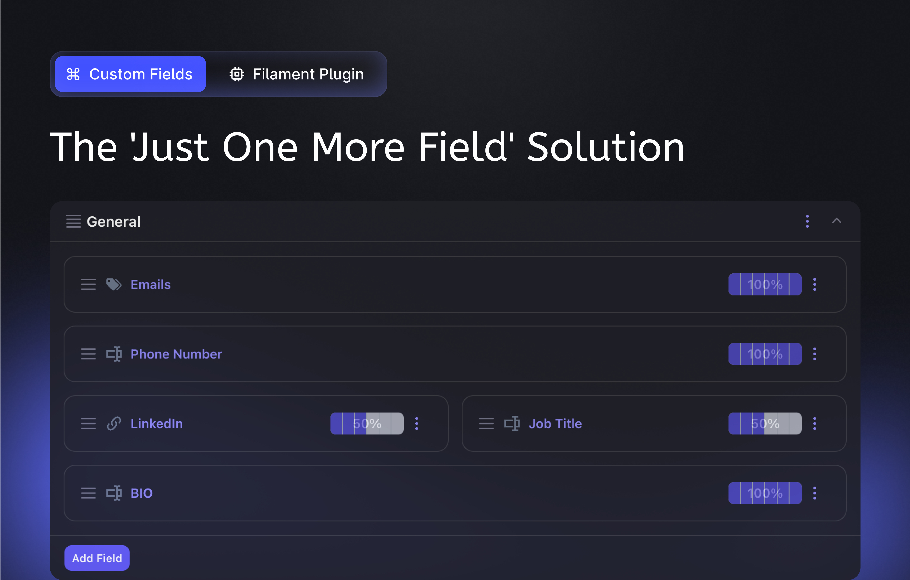

<p align="center">
  <a href="https://packagist.org/packages/relaticle/custom-fields"></a>
  <a href="https://laravel.com/docs/12.x"></a>
  <a href="https://php.net"></a>
  <a href="https://github.com/Relaticle/custom-fields/blob/main/LICENSE"></a>
</p>

A powerful Laravel/Filament plugin for adding dynamic custom fields to any Eloquent model without database migrations.

## ✨ Features

- **18+ Field Types** - Text, number, date, select, rich editor, and more
- **Conditional Visibility** - Show/hide fields based on other field values
- **Multi-tenancy** - Complete tenant isolation and context management
- **Filament Integration** - Forms, tables, infolists, and admin interface
- **Import/Export** - Built-in CSV capabilities
- **Security** - Optional field encryption and type-safe validation
- **Extensible** - Custom field types and automatic discovery (coming soon)

## 🔧 Requirements

- PHP 8.1+
- Laravel via Filament 3.0+

## 🚀 Quick Start

### Installation

```bash
composer require relaticle/custom-fields
php artisan custom-fields:install
```

### Integrating Custom Fields Plugin into a panel

```php
use Relaticle\CustomFields\CustomFieldsPlugin;
use Filament\Panel;

public function panel(Panel $panel): Panel
{
    return $panel
        // ... other panel configurations
        ->plugins([
            CustomFieldsPlugin::make(),
        ]);
}
```

### Setting Up the Model

Add the trait to your model:

```php
use Relaticle\CustomFields\Models\Contracts\HasCustomFields;
use Relaticle\CustomFields\Models\Concerns\UsesCustomFields;

class Post extends Model implements HasCustomFields
{
    use UsesCustomFields;
}
```

Add to your Filament form:

```php
use Filament\Schemas\Schema;
use Relaticle\CustomFields\Facades\CustomFields;

public function form(Schema $schema): Form
{
    return $schema->components([
        // Your existing form fields...
        
        CustomFields::form()->forModel($schema->getRecord())->build()
    ]);
}
```

## 📚 Documentation

**Full documentation and examples:** https://custom-fields.relaticle.com/

- [Installation Guide](https://custom-fields.relaticle.com/installation)
- [Quickstart](https://custom-fields.relaticle.com/quickstart)
- [Configuration](https://custom-fields.relaticle.com/essentials/configuration)
- [Authorization](https://custom-fields.relaticle.com/essentials/authorization)
- [Preset Custom Fields](https://custom-fields.relaticle.com/essentials/preset-custom-fields)

## 🤝 Contributing

Contributions welcome! Please see our [contributing guide](https://custom-fields.relaticle.com/help-support/contributing).

## 📄 Licensing

This plugin is dual-licensed: **Open Source (AGPL-3.0)** for open source projects, and **Commercial License** for closed-source projects.

**AGPL-3.0 requires your entire application to be open source.** For private/closed-source projects, you need a commercial license.

**More Information:** [License Details](https://custom-fields.relaticle.com/legal-acknowledgments/license)  
